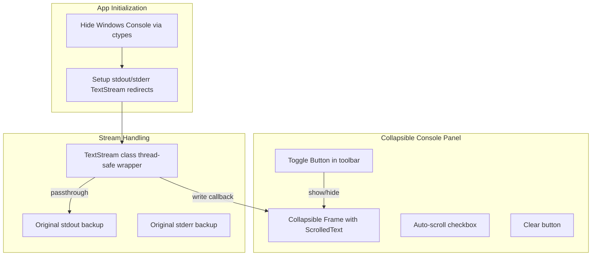

# Console Output Widget Integration Plan

## Summary

Add stdout/stderr capture and display as a toggleable collapsible panel in the tkinter-based LoggerApp, while suppressing the default Windows console window for development/script execution.

## Architecture

## Files to Modify/Create

### 1. Create new tkinter console widget

**File**: [`src/phologtolabstreaminglayer/features/console_output_tk.py`](src/phologtolabstreaminglayer/features/console_output_tk.py) (new)

Create a tkinter-native console output widget with:

- `TkTextStream` class - thread-safe stdout/stderr wrapper using `root.after()` for thread-safe UI updates
- `ConsoleOutputFrame` class - collapsible frame with ScrolledText, auto-scroll, clear button
- Max line limiting to prevent memory issues
- Cross-platform support (no Windows-specific GUI code in the widget itself)

### 2. Console window suppression utility

**File**: [`src/phologtolabstreaminglayer/features/hide_console.py`](src/phologtolabstreaminglayer/features/hide_console.py) (new)

Platform-safe console hiding:

- Windows: Use `ctypes` to call `kernel32.FreeConsole()` or hide the window
- macOS/Linux: No-op (no console window by default for GUI apps)
- Safe fallback if ctypes fails

### 3. Integrate into LoggerApp

**File**: [`src/phologtolabstreaminglayer/logger_app.py`](src/phologtolabstreaminglayer/logger_app.py)

- Import and call `hide_console_window()` at app startup
- Add `ConsoleOutputFrame` as collapsible panel below the log display area
- Add toggle button to show/hide the console panel
- Connect existing `update_log_display()` to also write to console panel for unified logging
- Ensure cleanup on app close (restore original streams)

### 4. Update entry point

**File**: [`logger_app.py`](logger_app.py)

- Call `hide_console_window()` before creating the tk root window

## Key Implementation Details

**Thread Safety**: Use tkinter's `root.after()` to schedule UI updates from non-main threads (critical since stdout/stderr can be written from background threads like recording_worker).

**Stream Passthrough**: Keep writing to original stdout/stderr so IDE debuggers and terminal output still work when available.

**Graceful Cleanup**: Restore original streams in `on_closing()` to prevent crashes during shutdown.

**Performance**: Limit buffer to ~10,000 lines, use `after_idle()` for batched updates.

## Todos