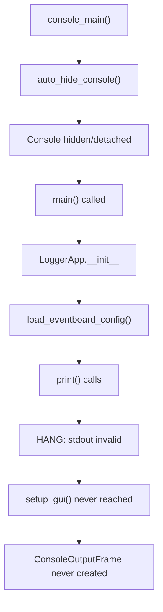

# Fix Windows Console Hide Startup Hang

## Problem Analysis

The application hangs on startup due to this sequence:

**Key Issues:**

1. `auto_hide_console()` is called in [`logger_app.py:51`](PhoLogToLabStreamingLayer/logger_app.py) BEFORE Tk/ConsoleOutputFrame is created
2. `hide_console_window()` in [`hide_console.py:52-56`](PhoLogToLabStreamingLayer/src/phologtolabstreaminglayer/features/hide_console.py) falls back to `FreeConsole()` which makes stdout/stderr invalid
3. Print statements in `load_eventboard_config()` at [`logger_app.py:831-843`](PhoLogToLabStreamingLayer/src/phologtolabstreaminglayer/logger_app.py) execute BEFORE `setup_gui()` creates ConsoleOutputFrame
4. Writes to invalid/hidden console block indefinitely rather than raising exceptions

## Solution

### 1. Make hide_console.py safer

After hiding or freeing the console, redirect stdout/stderr to safe dummy streams that discard output. This prevents any code from hanging on print() before ConsoleOutputFrame takes over.

Modify [`hide_console.py`](PhoLogToLabStreamingLayer/src/phologtolabstreaminglayer/features/hide_console.py):

- After `ShowWindow(console_window, 0)` or `FreeConsole()`, replace `sys.stdout` and `sys.stderr` with `io.StringIO()` or a custom null writer
- Return a flag or store state indicating console was hidden (for ConsoleOutputFrame to know)

### 2. Add pass-through control to ConsoleOutputFrame

Modify [`console_output_tk.py`](PhoLogToLabStreamingLayer/src/phologtolabstreaminglayer/features/console_output_tk.py):

- Add `pass_through: bool = True` parameter to `ConsoleOutputFrame.__init__()`
- When `pass_through=False`, `TkTextStream` should not attempt to write to original streams
- Auto-detect if console was hidden and skip passthrough

### 3. Update logger_app.py integration

- Pass `pass_through=False` to ConsoleOutputFrame when console is hidden
- Optionally move ConsoleOutputFrame creation earlier to capture more output